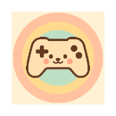
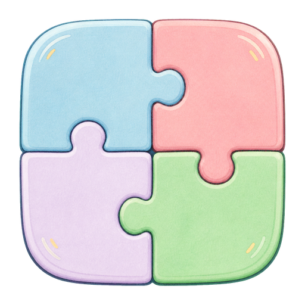
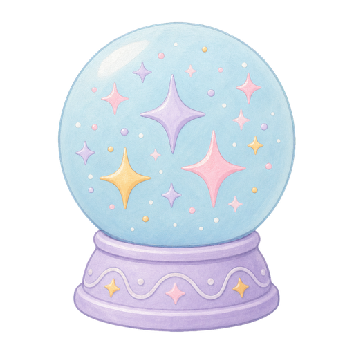

<p align="center">
  
</p>

<h1 align="center">Gentle Games</h1>

<p align="center"><strong>Calm play, without pressure.</strong></p>

<p align="center">
  A free and open-source collection of sensory-considerate games for children who prefer gentle, predictable digital experiences.
</p>

<p align="center">
  <a href="https://rogersau.github.io/gentle-games/"><strong>Play in your browser</strong></a>
  ·
  <a href="https://rogersau.github.io/gentle-games/docs/support.html">Get support</a>
  ·
  <a href="https://rogersau.github.io/gentle-games/docs/privacy-policy.html">Privacy</a>
</p>

<p align="center">
  <strong>No ads</strong> · <strong>No purchases</strong> · <strong>No accounts</strong> · <strong>No time pressure</strong>
</p>

> Gentle Games was created especially for children with sensory sensitivities, including autistic children. It is a play app—not a therapy, treatment, or assessment tool.

## A quieter kind of screen time

Gentle Games gives children a place to play, create, and explore at their own pace. There are no streaks to maintain, advertisements to dismiss, competitive leaderboards, or surprise interruptions.

Children and caregivers can adjust sound, motion, appearance, and other comfort settings. Activities use clear language, large touch targets, predictable interactions, and gentle feedback. A child can pause, restart, or leave whenever they choose.

## Explore the games

<table>
  <tr>
    <td align="center" width="25%">
      <br />
      <strong>Memory Snap</strong><br />
      Match friendly pictures at a comfortable pace.
    </td>
    <td align="center" width="25%">
      <br />
      <strong>Drawing Pad</strong><br />
      Draw, make shapes, undo, and continue later.
    </td>
    <td align="center" width="25%">
      <br />
      <strong>Glitter Fall</strong><br />
      Add, move, watch, and settle soft sparkles.
    </td>
    <td align="center" width="25%">
      <br />
      <strong>Bubble Pop</strong><br />
      Pop moving bubbles or use stationary buttons.
    </td>
  </tr>
  <tr>
    <td align="center" width="25%">
      <br />
      <strong>Category Match</strong><br />
      Sort familiar pictures using tap or drag.
    </td>
    <td align="center" width="25%">
      <br />
      <strong>Keepy Uppy</strong><br />
      Tap to keep one or more balloons floating.
    </td>
    <td align="center" width="25%">
      <br />
      <strong>Breathing Garden</strong><br />
      Watch or follow an optional visual breathing rhythm.
    </td>
    <td align="center" width="25%">
      <br />
      <strong>Pattern Train</strong><br />
      Complete cosy repeating patterns without a timer.
    </td>
  </tr>
</table>

## Designed around comfort and choice

- **Child-led play:** no forced pace, required score, or compulsory completion.
- **Sensory controls:** sounds can be muted and reduced-motion preferences are respected.
- **Predictable interactions:** consistent navigation and clear, neutral feedback.
- **Accessible input:** large touch targets and tap alternatives where dragging may be difficult.
- **Flexible appearance:** light and dark themes with soft, readable colour palettes.
- **Offline-first:** the installed app remains useful without a continuous internet connection.
- **Open from the start:** no locked activities, subscriptions, or hidden purchases.

## Try Gentle Games

The easiest way to explore the project is the web app:

**[Open Gentle Games](https://rogersau.github.io/gentle-games/)**

On supported browsers, it can also be installed to the home screen as a Progressive Web App (PWA).

## Contributing

Contributions are welcome, particularly improvements to accessibility, sensory comfort, translations, testing, and new low-pressure activities.

When contributing, please preserve the project's core approach:

- use simple, inclusive language;
- avoid flashing, jarring motion, forced timers, and disruptive feedback;
- provide sound-off and reduced-motion experiences;
- offer tap or button alternatives to gesture-only interactions;
- route all visible text through the translation system;
- describe immediate game interactions without making therapy or developmental claims.

### Local development

A current Node.js LTS release and npm are required.

```bash
git clone https://github.com/rogersau/gentle-games.git
cd gentle-games
npm install
npm run web
```

For Expo's interactive development server instead:

```bash
npm start
```

From the Expo terminal, press `a` for Android, `i` for iOS on macOS, or `w` for web. You can also use Expo Go on a supported physical device.

<details>
<summary><strong>Testing and quality checks</strong></summary>

```bash
# Tests and TypeScript checks used by shared CI
npm run ci:shared

# Web, Android, and iOS export validation
npm run ci:platform

# Complete local CI pass
npm run ci:all

# Individual checks
npm test
npm run typecheck
npm run lint
npm run fmt:check
```

To run one test file:

```bash
npm run test:single -- src/utils/gameLogic.test.ts
```

</details>

<details>
<summary><strong>Build and platform validation</strong></summary>

```bash
# Production web/PWA build
npm run build:pwa

# Platform exports
npm run build:web
npm run build:android
npm run build:ios
npm run build:all

# Launch through Expo
npm run android
npm run ios
```

Android emulator smoke testing also uses the scripts below and requires an emulator plus the Maestro CLI:

```bash
npm run smoke:android:build
npm run smoke:android:install
npm run smoke:android:test
```

</details>

### Project structure

```text
gentle-games/
├── assets/                    # App, splash, and PWA artwork
├── docs/                      # Website, privacy, and support pages
├── src/
│   ├── assets/game-icons/     # Game artwork used by the app and this README
│   ├── components/            # Reusable game components
│   ├── context/               # App settings and shared state
│   ├── games/                 # Game registry, settings, and outcome definitions
│   ├── guided-practice/       # Shared guided-practice behaviour
│   ├── i18n/                  # Translations
│   ├── screens/               # App and game screens
│   ├── ui/                    # Shared design system and layout helpers
│   └── utils/                 # Game logic and supporting utilities
├── App.tsx                    # Navigation and app entry component
├── app.config.js              # Expo application configuration
└── package.json
```

### Adding a game

A new activity normally needs:

1. a screen and any reusable components;
2. an entry in [`src/games/registry.ts`](src/games/registry.ts);
3. an outcome definition in [`src/games/outcomes.ts`](src/games/outcomes.ts);
4. navigation and translated text;
5. accessibility behaviour and tests;
6. artwork that matches the existing calm visual language.

## Project links

- [Project website](https://rogersau.github.io/gentle-games/docs/)
- [Privacy policy](https://rogersau.github.io/gentle-games/docs/privacy-policy.html)
- [Support](https://rogersau.github.io/gentle-games/docs/support.html)
- [Issue tracker](https://github.com/rogersau/gentle-games/issues)

## Licence

Gentle Games is free and open-source software released under the [GNU General Public License v3](LICENSE).

---

<p align="center">Made with care for gentler, more predictable play.</p>
